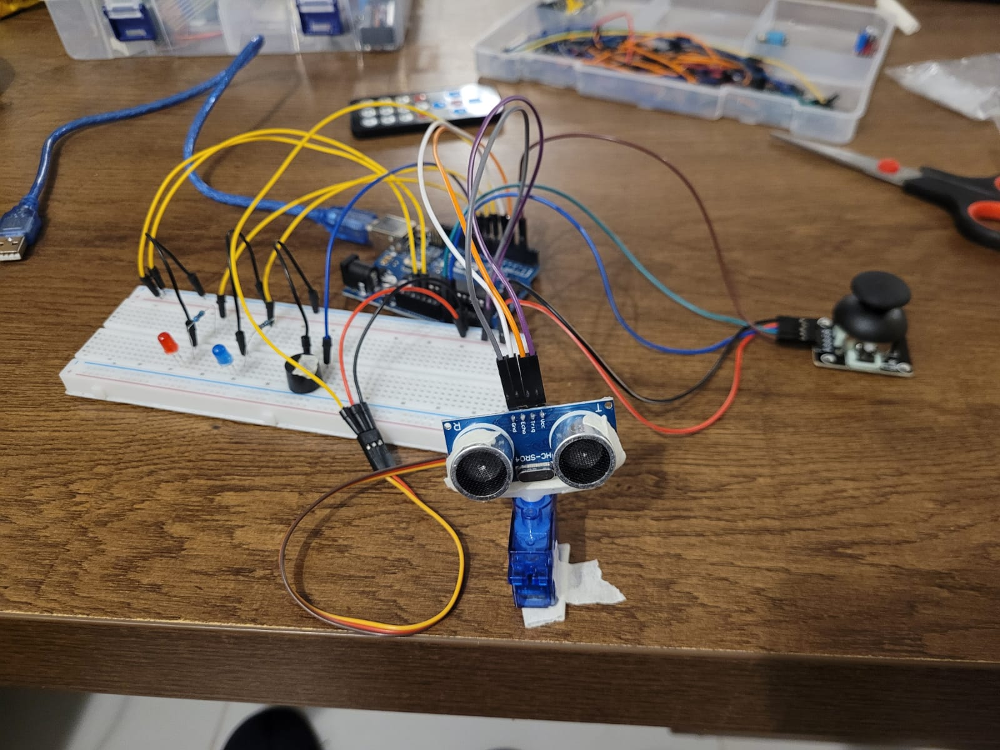
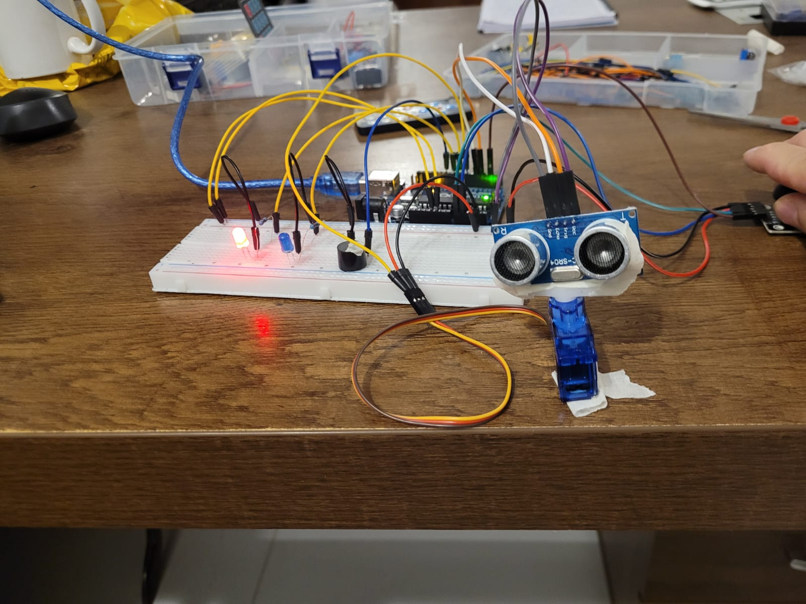
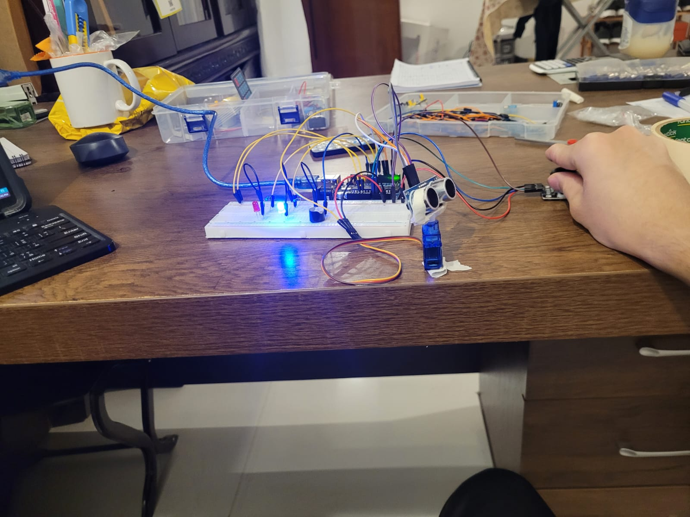

# Arduino---Joystick-Controlled-Servo-with-Ultrasonic-Object-Detection


# Description:
Arduino---Joystick-Controlled-Servo-with-Ultrasonic-Object-Detection

This project combines a joystick, servo motor, ultrasonic sensor, two LEDs, and a buzzer to create an interactive object detection system.

The joystick is used to rotate the servo motor left and right.

Mounted on top of the servo is an ultrasonic sensor, which rotates with the servo to scan different directions.

If the ultrasonic sensor detects an object within a certain distance threshold, the system:

Turns ON the red LED

Activates the buzzer to give an alert.


If no object is detected in range, the system:

Turns ON the blue LED

The buzzer remains OFF.

This setup simulates a basic scanning turret or obstacle detection system. It’s great for learning about real-time sensor feedback, motor control, and multi-component interaction using Arduino.


# Pictures:





# Code Below:
```cpp
#include <Servo.h>

Servo servo;


byte blueLED = 8;
byte redLED = 9;
byte buzzer = 11;
byte trig = 4;
byte echo = 5;


int pinX = A1;

byte angle;
unsigned long travelTime = 0;
int distance;
int joyValue;


void setup() {
  servo.attach(7);
  servo.write(0);
  pinMode(redLED, OUTPUT);
  pinMode(blueLED, OUTPUT);
  pinMode(buzzer, OUTPUT);
  pinMode(trig, OUTPUT);
  pinMode(echo, INPUT);
  delay(1000);
}

void loop() {
  joyValue = analogRead(pinX);

  digitalWrite(trig, LOW);
  delayMicroseconds(10);
  digitalWrite(trig, HIGH);
  delayMicroseconds(5);
  digitalWrite(trig, LOW);

  travelTime = pulseIn(echo, HIGH);

  distance = (travelTime / 2) * 0.0343;

  angle = map(joyValue, 0, 1023, 0, 180);

  servo.write(angle);

  if (distance < 30) {
    digitalWrite(redLED, HIGH);
    digitalWrite(blueLED, LOW);
    digitalWrite(buzzer, HIGH);
  }

  else{
    digitalWrite(redLED, LOW);
    digitalWrite(blueLED, HIGH);
    digitalWrite(buzzer, LOW);
  }

  delay(200);
}
```
